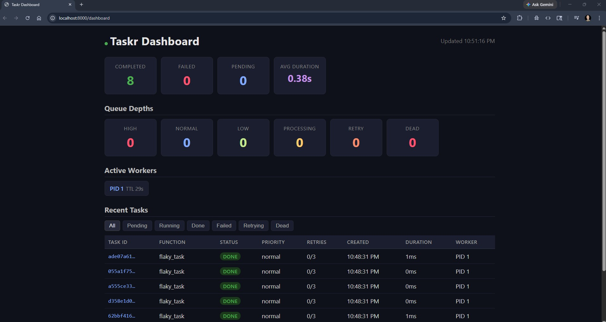
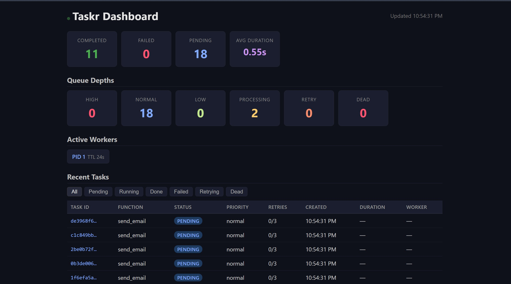

# Taskr

A distributed task queue built from scratch in Python. Celery-like, fully transparent.

**Stack:** Python, FastAPI, Redis, Jinja2 + HTML/CSS/JS (dashboard), Docker Compose

## How it works

The API accepts tasks over HTTP and pushes them into Redis priority queues. Workers pull tasks via `BRPOPLPUSH` (reliable queue pattern — tasks survive crashes). A scheduler re-queues failed tasks after exponential backoff. A reaper recovers tasks stuck in processing from crashed workers. A live dashboard shows everything in real time.

**Components:** API (producer + dashboard), Worker (executor), Scheduler (retry polling), Reaper (crash recovery), Redis (broker + state store).

## Run

```bash
docker-compose up --build --scale worker=3
```

Dashboard: http://localhost:8000/dashboard

## Usage

```bash
# Enqueue a task
curl -X POST http://localhost:8000/tasks \
  -H "Content-Type: application/json" \
  -d '{"function": "send_email", "args": ["user@example.com", "Hello"], "priority": "normal"}'

# Check status
curl http://localhost:8000/tasks/{task_id}

# Queue depths
curl http://localhost:8000/queues

# Active workers
curl http://localhost:8000/workers
```

## API

| Method | Path                 | Description             |
| ------ | -------------------- | ----------------------- |
| POST   | `/tasks`             | Enqueue a task          |
| GET    | `/tasks/{id}`        | Task status/result      |
| GET    | `/tasks?status=done` | List tasks (filterable) |
| DELETE | `/tasks/{id}`        | Cancel pending task     |
| GET    | `/queues`            | Queue depths            |
| GET    | `/workers`           | Active workers          |
| GET    | `/dashboard`         | Live dashboard          |
| GET    | `/health`            | Redis health check      |

## Key design decisions

- **Reliable queue:** `BRPOPLPUSH` atomically moves tasks to a processing list. If a worker crashes, the reaper re-queues them after 60s.
- **Priority:** Three Redis lists (high/normal/low), drained in order.
- **Exponential backoff:** Failed tasks retry after 2^n seconds via a Redis sorted set. After max retries, tasks move to a dead letter queue.
- **Heartbeats:** Workers write a TTL=30s key every 10s. Dashboard and reaper use this for liveness detection.
- **Async concurrency:** Workers run N tasks concurrently via `asyncio.Semaphore`.

## Tests

```bash
pip install -r requirements.txt
pytest -v
```

Uses `fakeredis` — no running Redis needed.

## Structure

```
taskr/
├── docker-compose.yml
├── Dockerfile
├── requirements.txt
├── app/
│   ├── main.py            # FastAPI API + dashboard
│   ├── config.py           # Settings
│   ├── models.py           # Task model
│   ├── queue.py            # Redis queue ops
│   ├── worker.py           # Worker process
│   ├── scheduler.py        # Retry scheduler
│   ├── reaper.py           # Crash recovery
│   └── tasks/
│       └── sample_tasks.py # Registered tasks
├── templates/
│   └── dashboard.html
└── tests/
    ├── test_queue.py
    └── test_worker.py
```

## Demo




